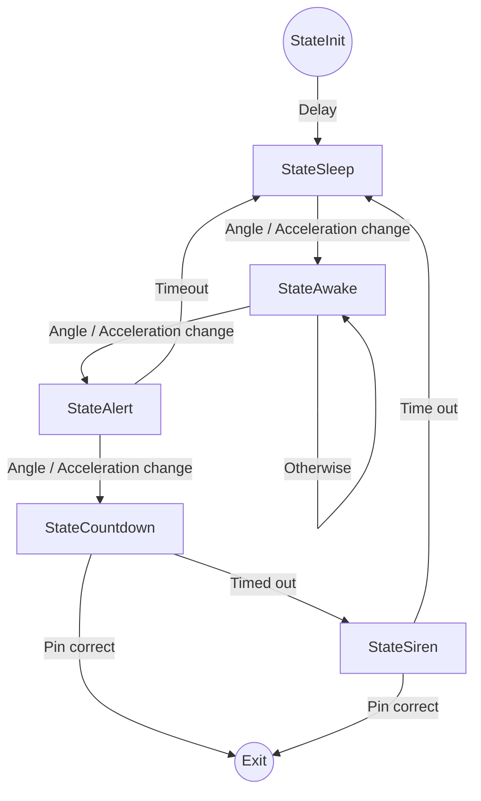

# Burgler Alarm

## State machine

```mermaid
graph TD;
    StateInit((StateInit)) -- Delay --> StateSleep
    StateSleep -- Angle / Acceleration change --> StateAwake
    StateAwake -- Otherwise --> StateAwake
    StateAwake -- Angle / Acceleration change --> StateAlert
    StateAlert -- Timeout --> StateSleep
    StateAlert -- Angle / Acceleration change --> StateCountdown
    StateCountdown -- Pin correct --> Exit((Exit))
    StateCountdown -- Timed out --> StateSiren
    StateSiren -- Pin correct --> Exit
    StateSiren -- Time out --> StateSleep
```