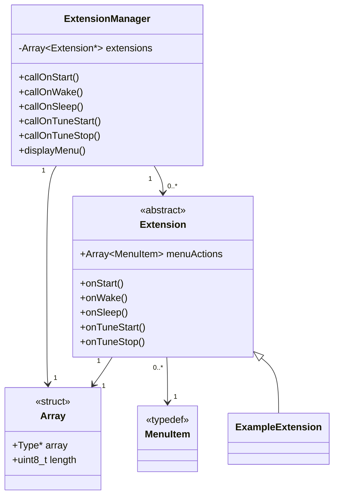

# Extensions
I have attempted to make the firmware fairly modular and most non-core parts have been included as externsions. This allows for easier maintenance and customisation.

## Extensions overview
All files relating to extensions are in the `src/extensions` folder of the firmware. `extensionsManager.h` contains the framework for the extensions system and `extensions.h` includes and specifies which extensions are enabled.

## Using extensions / menu system
Each extension will behave slightly differently. Some extensions may need to have functionality activated / run on command. This is addressed through a menu system.

To enter the menu, press the change tune button for more than two seconds. The next item can be selected by short pressing the change tune button. If this button has been pressed more times than there are items, the menu will go back to the start and play a short beep. To select an item, long press the change tune button.

If at any time, the horn button is pressed, the menu will be exited and the horn will sound. This is for safety reasons to keep the horn sound available as much as possible.

## Adding and removing an extension
To add an extension, modify `extensionsManager.h`.

Include the extension header file and create an instance:
```c++
#include "exampleExtension.h"
ExampleExtension exampleExtension;
```

Add a reference to the instance to the array of extensions:
```c++
Extension* extensionsList[] = {
    &exampleExtension,
    // ... Other extension instances
};
```
The order in this array affects the order that extensions are called for each hook and the order that they appear in the menu if they have menu items.

## Existing extensions
- **[Burgler alarm](BurglerAlarm.md)** - Uses an accelerometer to sound the siren if disturbed.
- **Example extension** - Demonstrates how extensions may be implemented.
- **Log run time** - Logs how many times and for how long the horn is used to EEPROM for battery life estimates.
- **Measure battery** - Prints the battery voltage to the serial console every so often.
- **MIDI synth** - Allows the horn to function as a MIDI synth.
- **SOS** - Plays the morse SOS tone indefinitely when selected from the menu.

## Extension structure
Each extension is a class that inherits the `Extension` class. This has a number of methods that can be overridden and are called on certain events occuring, such as on startup, waking up and playing tunes.

