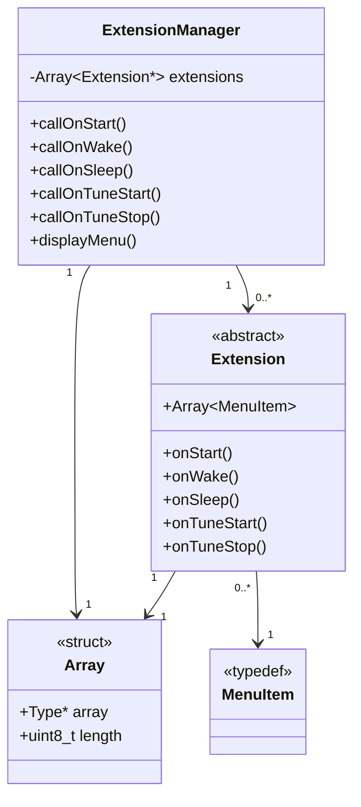

# Extensions
I have attempted to make the firmware fairly modular and most non-core parts have been included as externsions. This allows for easier maintenance and customisation.

## Extensions structure
All files relating to extensions are in the `src/extensions` folder of the firmware. `extensionsManager.h` contains the framework for the extensions system and `extensions.h` includes and specifies which extensions are enabled.

Each extension is a class that inherits the `Extension` class. This has a number of methods that can be overridden and are called on certain events occuring, such as on startup, waking up and playing tunes.

