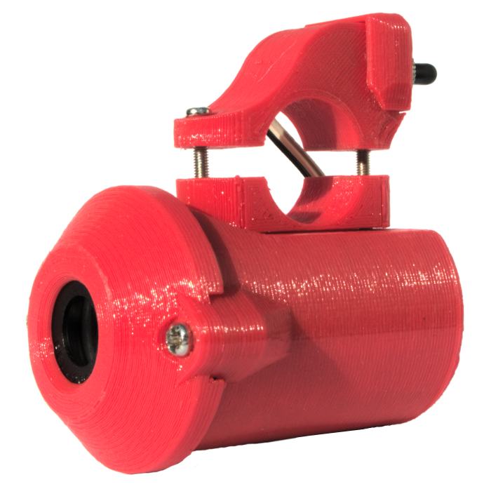
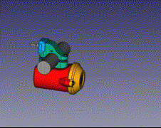

# BikeHorn
A "musical" siren for bicycles.

This design was published in the Circuit Notebook section of the [Februrary 2022 issue](https://www.siliconchip.com.au/Issue/2022/February) of the Silicon Chip magazine. Feel free to have a look there if you would like a nice explanation / writeup of the horn's operations and construction.

## Main steps for building and usage
1. Modify the Arduino nano for low power and low voltage usage.
2. Build the circuit - see [BikeHornPCB](BikeHornPCB) for a PCB design. The siren is from an old smoke alarm.
3. 3D print the case.
4. Optimise parameters for each note to be the loudest possible - see [Tuning](Tuning) for details.
5. Generate the tunes to play using [this Musescore plugin](https://github.com/jgOhYeah/TunePlayer/blob/main/extras/MusescorePlugin.md). Paste this into `tunes.h` in the main [BikeHorn sketch](BikeHorn).
6. Upload to the Arduino and test.
7. Mount on bicycle / vehicle and have fun.

See the Silicon Chip section or the [Images directory](Images) for relevent diagrams and images of the horn.

A low resolution gif that gives an idea of order of assembly:  

## Extensions
I have attempted to make the firmware fairly modular and most non-core parts have been included as externsions. This allows for easier maintenance and customisation. For more details on enabling, disabling and writing extensions, please see the [extensions documentation](Extensions.md).