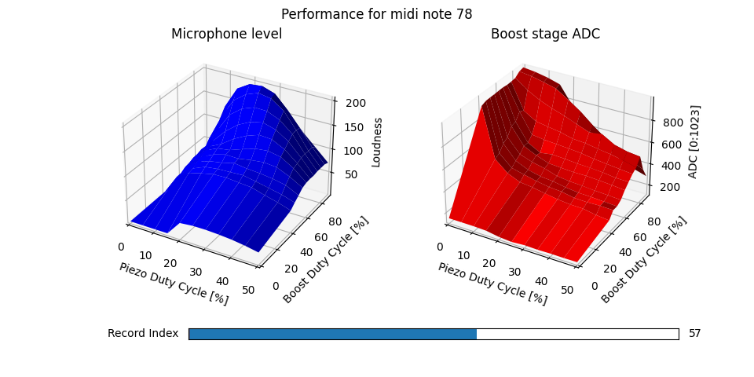
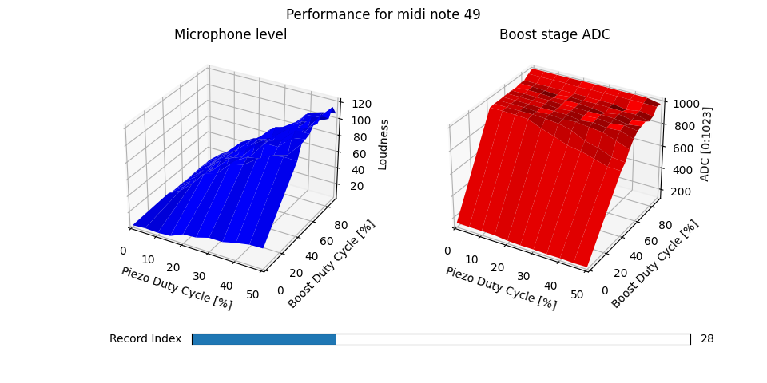
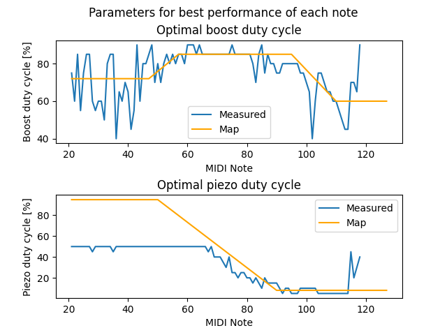
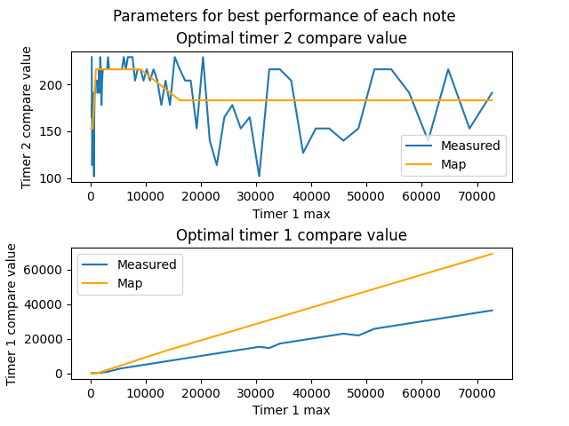
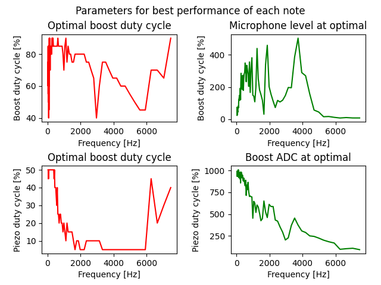

# Tuning
During testing, I noticed that the optimal duty cycle for maximum perceived volume of the first and second stages was highly variable and differed for each note. In the end I have written these testing scripts to brute force a range of values over a range of notes and use the microphone of the computer running it to find the loudest settings.

Note that the loudness values are arbitary and as the microphone is probably not calibrated, loudness values can only be compared for the same frequency (note).

> **Please note:** You might want to be careful about where and when you run this. It needs to be done in a fairly quiet place, but is VERY loud for quite a long time.

## Requirements
The scripts are written using Python 3. A few python libraries are required and can be installed using pip3:
```sh
sudo pip3 install sounddevice pyserial numpy matplotlib
```

## Data gathering
1. Flash the *Tuning.ino* sketch to the Arduino. This receives duty cycle and frequency instructions over the serial port, outputs them and if present, reads the ADC back.
2. Set the computer and horn up with the horn connected to the computer using the usb cable. Make sure the batteries are charged / will last the test.
3. Modify the ranges in *SoundLevel.py* to be what you want to test.
4. Run *SoundLevel.py*. After a few seconds, the horn should start making noises.
5. At the end of testing each note, the results will be saved to a file named *Recorded_Results.npz*. Any file from previous tests **will** be overwritten, so make sure to rename it to something else before running this script again.

## Displaying the data
1. From a terminal, run `python3 DisplayData.py [FILE TO DISPLAY]`, where `[FILE TO DISPLAY]` is the name of the file containg the data. If no filename is given, the script will attempt to load *Recorded_Results.npz*.

## Using the data
1. Check that there have been enough data points gathered and the range of values tested is big enough. For the *HF_Good_Recorded_Results.npz*, I didn't have the maximum piezo duty cycle high enough for finding the maximum loudness of lower frequencies, so I had to re run it for the lower notes with different parameters.
2. Edit the manual mapping (near the top of *DisplayData.py*) so that it roughly follows the recommended values in *Figure 2*. Once you are happy with this, the code that is given in the console can be copied and pasted into *soundGenerators.h*. Some manual cleaning up and optimisation will probably be required.

## Example graphs
### Figure 1
Understanding and analysis on a per note basis.

Example with a nice curve. Note the clearly visible peak on the blue graph indicating that a duty cycle of around 20% for the piezo and 80% for the first bosting stage are loudest for that note.


Example of a higher frequency note but still a nice curve.


Example of a lower frequency note but not enough range (no "peak" in curve). The piezo duty cycle range should include values over 50%.


### Figure 2
Visualising the actual mapping of ideal parameters across each note. Use this to set the orange line manually.


### Figure 3
Pretty much figure 2, but with the *x* axis transformed from midi notes to the maximum counter of timer 1 and *y* axis transformed to the compare value of each respective timer.


### Figure 4
Mainly for curiosity.
