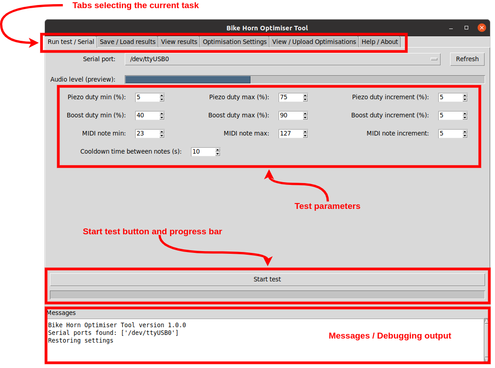
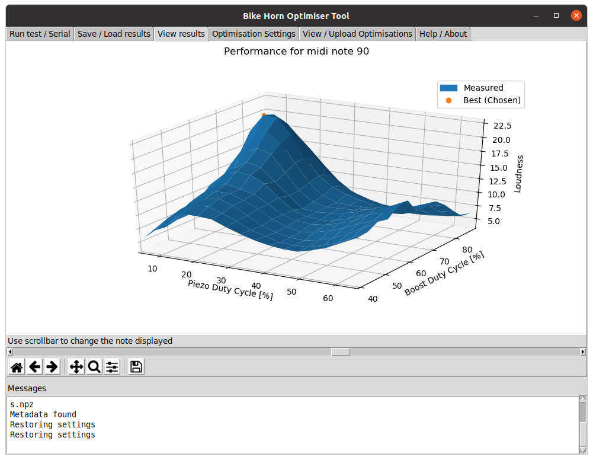
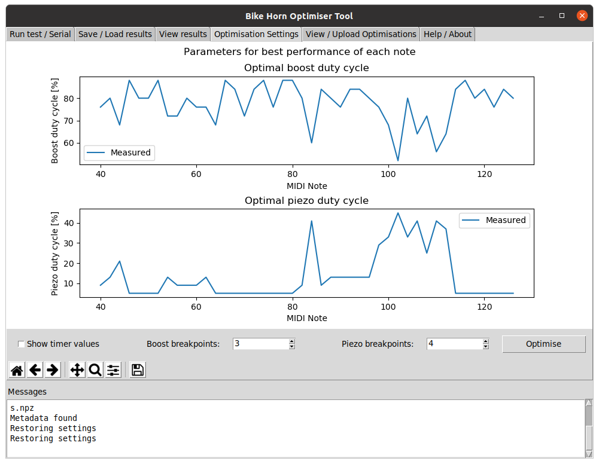

I find piezo sirens to be fairly fussy and unpredictable when trying to make them loud, especially across a broad range of frequencies. To help with this, I have written a small application to vary a couple of parameters under the horn's control and measure the resulting volume of the siren using a laptop / computer microphone. The data is then analysed and converted into a series of straight lines before being uploaded to the EEPROM memory of the Arduino in the horn.

This application is a python script and has been tested on Windows and Linux (Ubuntu), but should also work on Macintosh / other operating systems as long as the required libraries are installed.

> **Note:** This optimiser, the files it produces / uses and the way data is stored on the horn itself is in no way compatible with the earlier `SoundLevel.py` and `DisplayData.py` scripts. If you want to use or access these tools, you will need to use an [earlier release](https://github.com/jgOhYeah/BikeHorn/releases/tag/v1.0.0).

# Table of contents
- [Table of contents](#table-of-contents)
- [Installation](#installation)
- [Main Steps](#main-steps)
  - [Initial setup and running a test](#initial-setup-and-running-a-test)
  - [Saving and loading test results](#saving-and-loading-test-results)
  - [Interpreting and viewing test results](#interpreting-and-viewing-test-results)
  - [Optimising the test results](#optimising-the-test-results)
  - [Uplaoding to the horn](#uplaoding-to-the-horn)
  - [Advanced features and debugging](#advanced-features-and-debugging)
- [Troubeshooting](#troubeshooting)
  - [The serial port does not appear](#the-serial-port-does-not-appear)
  - ["Did not get a response from the horn" message](#did-not-get-a-response-from-the-horn-message)
  - [Arduino not resetting or misbehaving after using this application](#arduino-not-resetting-or-misbehaving-after-using-this-application)
  - [Application freezes when trying to close it](#application-freezes-when-trying-to-close-it)
- [Questions that may or may not be asked, let alone frequently asked](#questions-that-may-or-may-not-be-asked-let-alone-frequently-asked)
  - [Why store the optimised settings in EEPROM?](#why-store-the-optimised-settings-in-eeprom)
  - [Why is the optimising sketch not a part of the main bike horn sketch?](#why-is-the-optimising-sketch-not-a-part-of-the-main-bike-horn-sketch)
  - [Why the limit of 10 lines (9 breakpoints) per parameter to optimise?](#why-the-limit-of-10-lines-9-breakpoints-per-parameter-to-optimise)
  - [Why did the battery go flat after optimising?](#why-did-the-battery-go-flat-after-optimising)
# Installation
The application requires python 3 along with a few non built-in libraries. Assuming you already have python 3, the libraries can be installed with
```bash
pip3 install numpy sounddevice pyserial piecewise-regression matplotlib
```
Download this repository or at the very least [`BikeHornOptimiser.py`](BikeHornOptimiser.py) and the [corresponding Arduino sketch](OptimiserSketch).

# Main Steps
## Initial setup and running a test
1. Upload the [Optimiser Sketch](OptimiserSketch) to the horn.
2. Find a quiet place to make not very quiet for the next little while.
3. Run [`BikeHornOptimiser.py`](BikeHornOptimiser.py). On Windows, this seems to be a little slow in starting. If no window appears, attempt to run the script from the terminal and see if there is any error messages or missing libraries reported. A window should appear looking something like this:  

4. If you have existing test data with settings you would like to reuse, open this file using the *Save / Load results* tab (see the [Saving and loading test results](#saving-and-loading-test-results).
5. Navigate to the *Run Test / Serial* tab (you will be on it by default). Connect the horn to the computer using a mini usb cable and select its serial port (something like `COM6` on Windows and `/dev/ttyUSB0` or `/dev/ttyACM0` on other operating systems). Try clicking the *Refresh* button if the serial port is not listed.
6. Edit the parameters for which to run the test with. These allow you to specify the ranges of duty cycles to test for driving the piezo siren and driving the voltage boosting stage, as well as the amount to increment these values between each test. You can also select what range of MIDI notes to test and allow the horn to cool down for a few seconds in between testing each MIDI note.
7. When ready, click *Start test*. If it is greyed out, no serial port is selected. Select the horn's serial port and try again. All going well, the horn should start making noises a few seconds later. The message box will print an estimate of the time that the test will take followed by the progress

## Saving and loading test results
Test results can be saved and loaded from a file so that the results can be analysed and uploaded at a different time to when the test is run. In case of crashes or unexpected interruptions when running a test, a backup file is saved after testing each note. This has the same name at the currently opened file (or one based off the time the application was started if nothing was opened) with "BACKUP" appended to the end.

Use the *Open* button to open a file, loading stored settings and test data and the *Save as* button to save all existing settings and test data. Opening a file will clear any existing, unsaved data.

## Interpreting and viewing test results
The *View results* tab contains a 3D surface plot for each note showing the percieved loudness as each of the two parameters of the duty cycle for the piezo element and the boost stage are varied. The optimal settings of these duty cycles are the highest point on the loudnes scale (marked by an orange dot). The scroll bar below the graph can be used to adjust the data for which note is displayed. Some notes will have a nice, clean surface such as this example:  
  
Other notes appear much noisier in their data. The aim is to reduce this noise as much as possible, although I'm not quite sure how to do this at the moment apart from trying to minimise background noise during the testing process.

The *Optimisation settings* tab shows the settings picked as optimal for each midi note (i.e. the settings for the orange dot in the *View results* tab for each midi note). An example of this is shown below:  


## Optimising the test results
TODO

## Uplaoding to the horn
TODO
- Preview, upload

## Advanced features and debugging
TODO

# Troubeshooting
## The serial port does not appear
Check whether other software such as the Arduino IDE can see the serial port. Make sure no other programs have it open or are currently using it.

## "Did not get a response from the horn" message
Are you using the correct serial port and is the [Optimiser sketch](OptimiserSketch/) uploaded to the horn? Also make sure no other software is currently using the serial port. If this doesn't work, try unplugging and replugging in the usb cable.

## Arduino not resetting or misbehaving after using this application
Try unplugging and replugging in the usb cable.
## Application freezes when trying to close it
This is a bug I have not worked out yet - something to do with the audio level monitoring. If you are running the application in a terminal, try using *Control-C* a couple of times. If that doesn't work or you aren't using a terminal, kill the program using the task manager.

# Questions that may or may not be asked, let alone frequently asked
## Why store the optimised settings in EEPROM?
The original optimisation scripts outputted C++ code to paste into the [Bike horn Arduino sketch](../BikeHorn). While this does work for one horn, I could see this becoming a problem if more than one horn is ever built, as you would end up with code that needs to be customised for each horn and then kept track of through updates and changing of the installed tunes, making it messy to deal with. Instead, the aim of storing the optimised settings in EEPROM is that the settings live with the horn rather than the source code, meaning that the same source code can theoreticaly be used with every horn in existance and they should all perform optimally as far as selecting the best duty cycles of each stage. Tunes may still need to be transposed to suit each horn's preferred frequency range though.

## Why is the optimising sketch not a part of the main bike horn sketch?
The aim of optimising is that it doesn't need to be done all that often. Seeing as the tunes are stored as part of the program, the horn will need to be reprogrammed whenever the installed tunes are uploaded, so it is not much of an extra burden to upload a special optimising sketch. It is also one less thing to potentially go wrong in the main sketch and besides, it allows even more room for tunes 😉.

## Why the limit of 10 lines (9 breakpoints) per parameter to optimise?
The processed optimisations are stored in EEPROM memory in the Arduino microcontroller on the horn. This is limited to 1024 bytes on an Arduino Nano. Each linear function takes up 8 bytes. Because (as an optional feature) the EEPROM is also used for tracking the number of times and for how long the horn is used for battery life monitoring, this resource needs to be shared. Feel free to adjust the parameters for the amount and addresses to allocate in the source code of this optimiser and 'defines.h' of the main bike horn sketch, making sure that they are in agreement for things to work as expected.

## Why did the battery go flat after optimising?
Unlike the main bike horn sketch, she optimiser sketch does not contain any power saving features. Thus, when taking a break or leaving the horn sit, make sure to reflash the main [bike horn sketch](../BikeHorn) or take the batteries out.